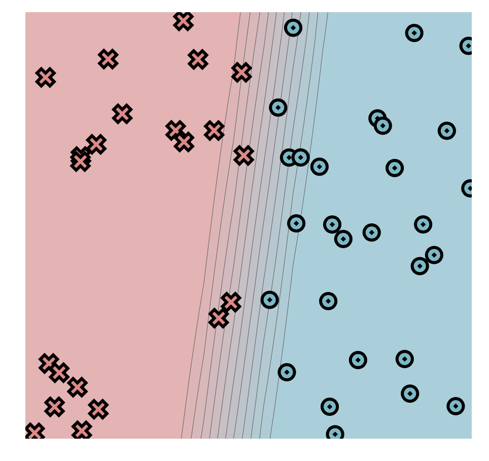
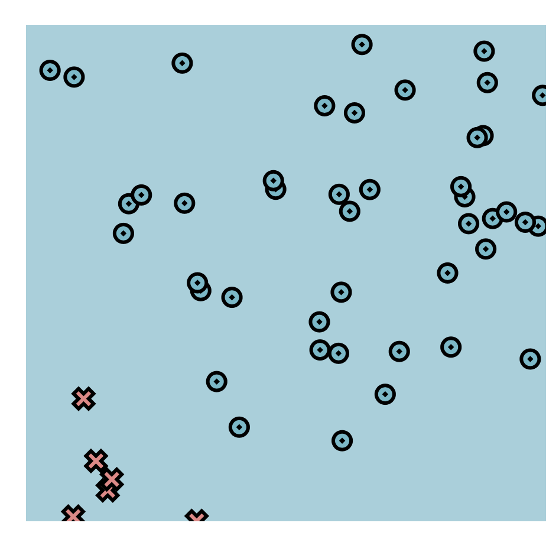
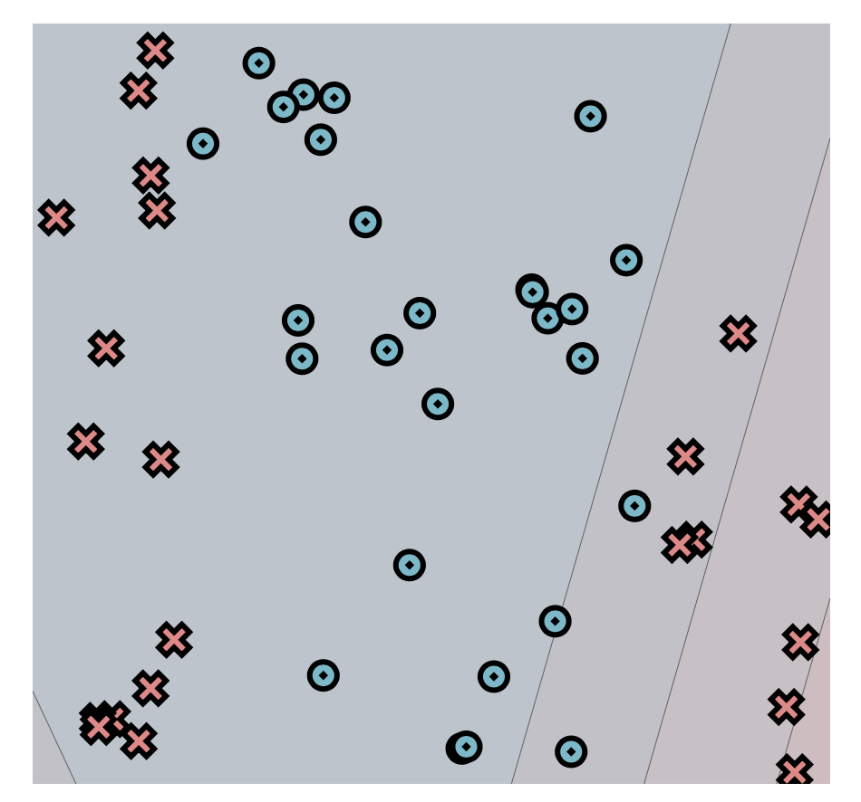
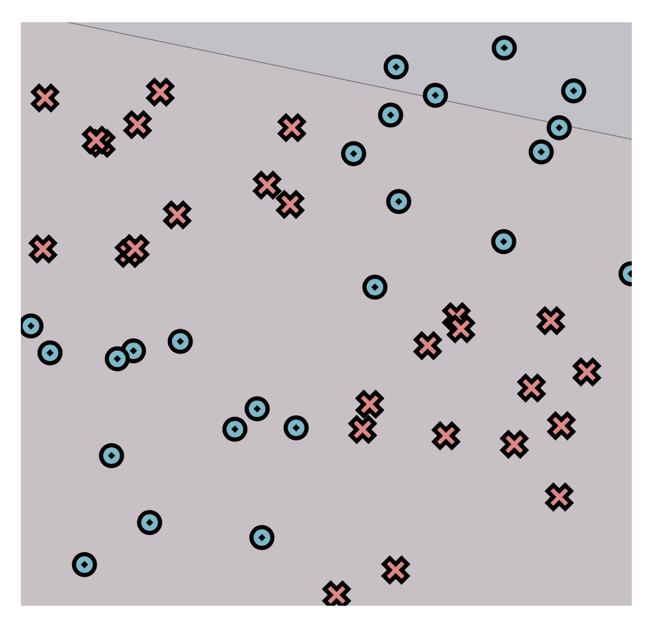
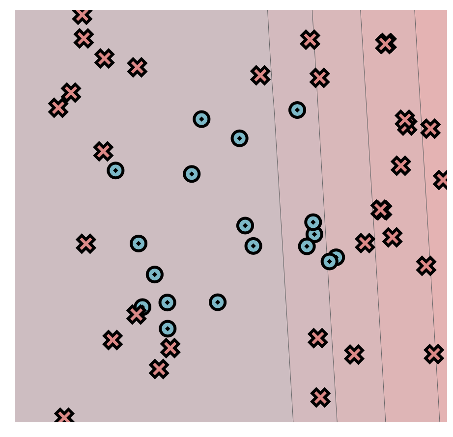
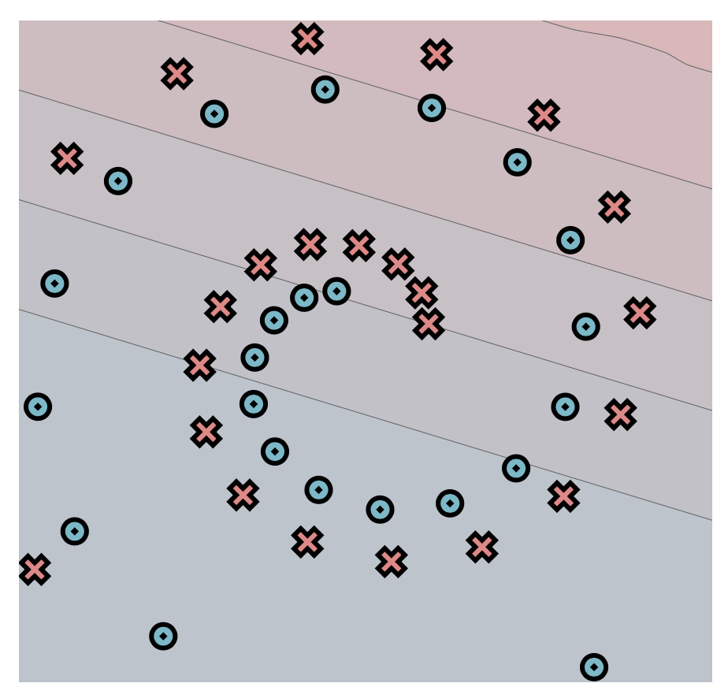

[](https://classroom.github.com/online_ide?assignment_repo_id=16926761&assignment_repo_type=AssignmentRepo)
# MiniTorch Module 2


* Docs: https://minitorch.github.io/

* Overview: https://minitorch.github.io/module2/module2/

This assignment requires the following files from the previous assignments. You can get these by running

```bash
python sync_previous_module.py previous-module-dir current-module-dir
```

The files that will be synced are:

        minitorch/operators.py minitorch/module.py minitorch/autodiff.py minitorch/scalar.py minitorch/module.py project/run_manual.py project/run_scalar.py

## Simple dataset

Time per epoch: 0.197s.


## Diag

Time per epoch: 0.198s.


## Split

Time per epoch: 0.196s.


## Xor

Time per epoch: 0.189s.


## Circle

Time per epoch: 0.190s.


## Spiral

Time per epoch: 0.189s.

